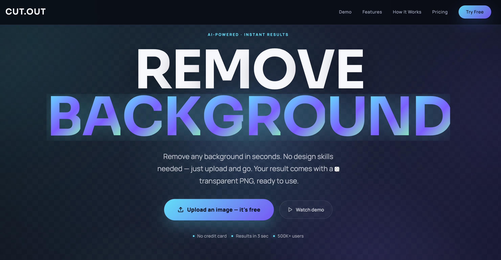

# CUT.OUT

Dark, motion-led landing page for an AI background removal product, built as a single static `index.html` demo with vanilla HTML, CSS, and JavaScript.

It includes:

- A kinetic hero with large typography and subtle parallax motion
- A before/after comparison slider using `input.png` and `output.png`
- A live demo section wired to the `fal.ai` Pixelcut background removal model
- API key input persisted in `localStorage`
- Feature, workflow, pricing, and CTA sections

## Preview

The page is designed to present an AI imaging product with a premium, modern feel while still letting visitors try background removal directly in the browser.



## Stack

- HTML
- CSS
- Vanilla JavaScript
- [GSAP](https://gsap.com/) for motion
- [fal.ai client](https://fal.ai/) for background removal

## Project Structure

```text
.
├── index.html      # Full landing page app
├── input.png       # Before image used in the comparison slider
├── output.png      # After image used in the comparison slider
├── screenshot.jpeg # README preview image
├── .env.example    # Example FAL_KEY configuration
└── README.md
```

## Run Locally

Because this is a static page that loads browser modules, serve it over HTTP instead of opening `index.html` directly from the filesystem.

### Option 1: Python

```bash
python3 -m http.server 8000
```

Then open:

[http://localhost:8000](http://localhost:8000)

### Option 2: Any static server

You can use any local web server you prefer, such as `npx serve`, a VS Code live server extension, or your own dev server.

## API Key Setup

Get a key from the [fal.ai dashboard](https://fal.ai/dashboard/keys).

This project supports two ways to think about configuration:

### In this demo page

- Open the page
- Scroll to the live demo section
- Paste your `FAL_KEY` into the API key field
- The key is stored in that browser's `localStorage`
- Requests are sent directly from the browser to `fal.ai`

### In a real production setup

Do not expose your secret key in the client.

Use `.env.example` as a reference:

```env
FAL_KEY=your_fal_key_here
```

For production, load `FAL_KEY` on your server and proxy requests through a backend.

## How the Demo Works

1. The user selects an image in the live demo section.
2. The file is uploaded through the `fal.ai` client.
3. The app subscribes to the Pixelcut background removal model.
4. Queue/progress states are surfaced in the UI.
5. The final cutout is rendered back into the page.

## Main UX Elements

### Hero

- Kinetic "Remove Background" title
- Primary conversion CTA
- Trust micro-copy
- Before/after slider using real assets from this repo

### Live Demo

- API key field
- Upload flow
- Processing state
- Final cutout preview

### Supporting Sections

- Features grid
- How-it-works flow
- Pricing-style CTA blocks

## Notes

- The page is intentionally self-contained in `index.html` for fast iteration.
- The included `output.png` may contain transparency, so backgrounds behind it affect how it appears unless a solid backdrop is applied.
- If updates do not appear in the browser, do a hard refresh.

## Next Improvements

- Split styles and scripts into separate files
- Add a lightweight backend proxy for secure API usage
- Add analytics and conversion tracking
- Add more before/after samples
- Optimize assets for faster page load
